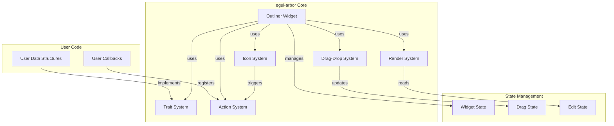
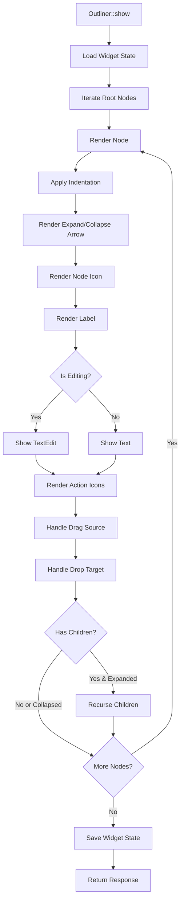
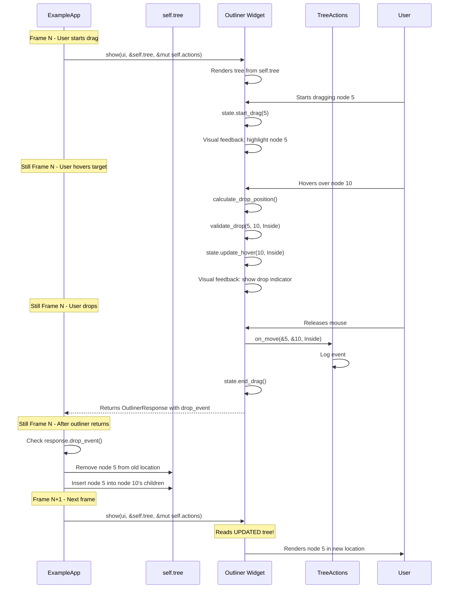
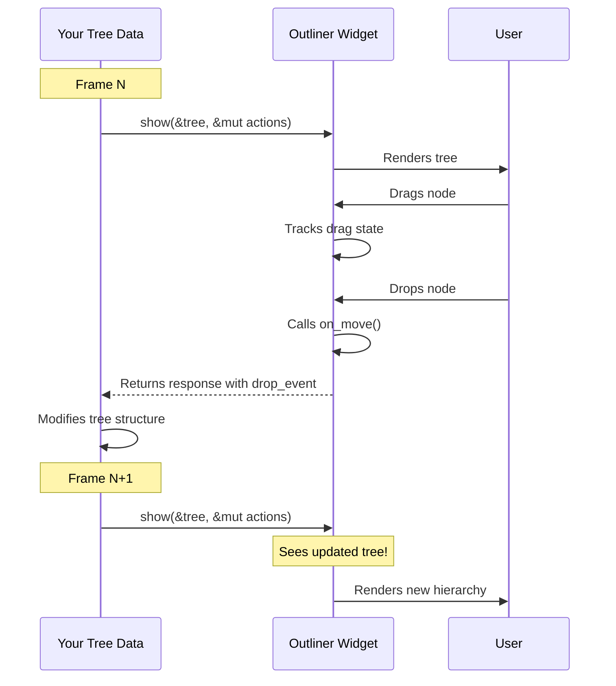
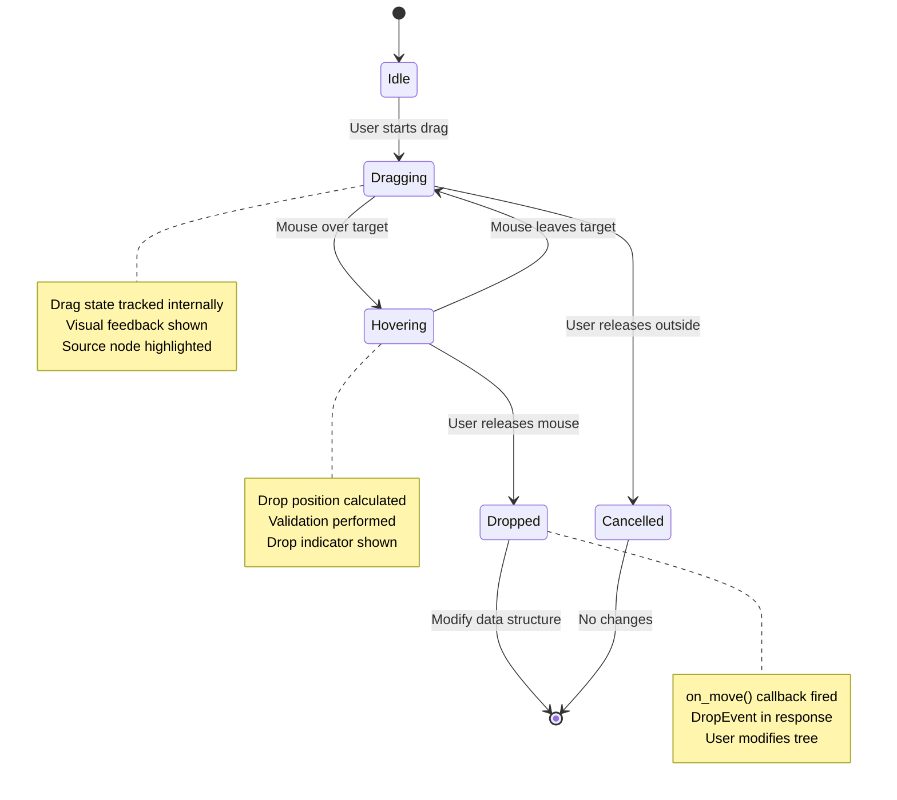
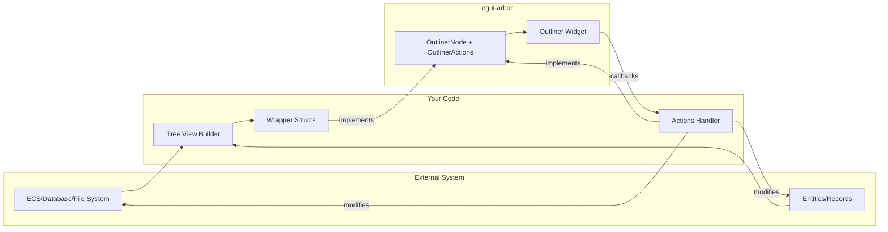

# egui-arbor Architecture

## Overview

egui-arbor is an outliner widget library for egui, inspired by Blender's outliner. It provides a hierarchical tree view with collections, entities, customizable icons, and drag-and-drop support.

**Note**: This architecture follows egui ecosystem conventions. See [`EGUI_ECOSYSTEM_ANALYSIS.md`](EGUI_ECOSYSTEM_ANALYSIS.md:1) for detailed comparison with other egui libraries.

## Core Design Principles

1. **User-Owned Data**: The library doesn't own the hierarchy data. Users implement traits on their own types.
2. **Trait-Based Integration**: Flexible trait system allows integration with any data structure.
3. **egui Memory Integration**: State stored using egui's memory system for automatic persistence.
4. **Immediate Mode**: Follows egui's immediate mode paradigm - widget reconstructed each frame.
5. **Type Safety**: Leverage Rust's type system for compile-time guarantees.
6. **Ecosystem Consistency**: API patterns match egui_extras, egui_plot, egui_dock, and other major libraries.

## Architecture Diagram



## Module Structure

```
egui-arbor/
├── src/
│   ├── lib.rs              # Public API exports
│   ├── outliner.rs         # Main Outliner widget
│   ├── state.rs            # OutlinerState (egui memory integration)
│   ├── style.rs            # Style configuration
│   ├── response.rs         # OutlinerResponse and related types
│   ├── traits/
│   │   ├── mod.rs
│   │   ├── node.rs         # OutlinerNode trait
│   │   └── actions.rs      # OutlinerActions trait
│   ├── icons/
│   │   ├── mod.rs
│   │   └── builtin.rs      # Built-in icon definitions
│   ├── drag_drop/
│   │   ├── mod.rs
│   │   └── types.rs        # Drag-drop event types
│   └── utils/
│       ├── mod.rs
│       └── id.rs           # ID utilities
```

**Key Changes from Initial Design:**
- Simplified module structure following egui ecosystem patterns
- State management integrated with egui's memory system
- Removed separate registry modules (integrated into traits)
- Added dedicated style and response modules
- Reduced complexity while maintaining functionality

## Core Components

### 1. Trait System

The trait system allows users to integrate their own data structures with the outliner.

#### OutlinerNode Trait

```rust
pub trait OutlinerNode {
    type Id: Hash + Eq + Clone;
    
    /// Unique identifier for this node
    fn id(&self) -> Self::Id;
    
    /// Display name of the node
    fn name(&self) -> &str;
    
    /// Whether this node can have children
    fn is_collection(&self) -> bool;
    
    /// Get children if this is a collection
    fn children(&self) -> Option<&[Self]> where Self: Sized;
    
    /// Get mutable children if this is a collection
    fn children_mut(&mut self) -> Option<&mut Vec<Self>> where Self: Sized;
    
    /// Icon to display next to the name (optional)
    fn icon(&self) -> Option<&str> {
        None
    }
    
    /// Action icons to display on the right side
    fn action_icons(&self) -> Vec<ActionIcon> {
        vec![
            ActionIcon::Visibility,
            ActionIcon::Lock,
            ActionIcon::Selection,
        ]
    }
}

pub enum ActionIcon {
    Visibility,
    Lock,
    Selection,
    Custom { icon: String, tooltip: Option<String> },
}
```

#### OutlinerActions Trait

```rust
pub trait OutlinerActions<N: OutlinerNode> {
    /// Called when a node is renamed
    fn on_rename(&mut self, node_id: &N::Id, new_name: String);
    
    /// Called when a node is moved (drag-drop)
    fn on_move(&mut self, node_id: &N::Id, new_parent: Option<&N::Id>, index: usize);
    
    /// Called when a node is selected
    fn on_select(&mut self, node_id: &N::Id, multi_select: bool);
    
    /// Get the current selection state
    fn is_selected(&self, node_id: &N::Id) -> bool;
    
    /// Get visibility state (for visibility icon)
    fn is_visible(&self, node_id: &N::Id) -> bool;
    
    /// Get lock state (for lock icon)
    fn is_locked(&self, node_id: &N::Id) -> bool;
    
    /// Toggle visibility
    fn toggle_visibility(&mut self, node_id: &N::Id);
    
    /// Toggle lock state
    fn toggle_lock(&mut self, node_id: &N::Id);
}
```

### 2. State Management

State is stored using egui's memory system, following ecosystem conventions.

#### OutlinerState

```rust
#[derive(Clone, Default)]
#[cfg_attr(feature = "serde", derive(serde::Serialize, serde::Deserialize))]
pub struct OutlinerState {
    /// Expanded/collapsed state of collections
    expanded: HashSet<egui::Id>,
    
    /// Node being renamed (if any)
    editing: Option<egui::Id>,
}

impl OutlinerState {
    /// Load state from egui memory
    pub fn load(ctx: &egui::Context, id: egui::Id) -> Self {
        ctx.data(|d| d.get_temp(id).unwrap_or_default())
    }
    
    /// Store state to egui memory
    pub fn store(self, ctx: &egui::Context, id: egui::Id) {
        ctx.data_mut(|d| d.insert_temp(id, self));
    }
    
    /// Check if a node is expanded
    pub fn is_expanded(&self, node_id: egui::Id) -> bool {
        self.expanded.contains(&node_id)
    }
    
    /// Toggle expansion state
    pub fn toggle_expanded(&mut self, node_id: egui::Id) {
        if self.expanded.contains(&node_id) {
            self.expanded.remove(&node_id);
        } else {
            self.expanded.insert(node_id);
        }
    }
}
```

### 3. Style System

Customizable styling following egui ecosystem patterns.

#### Style Definition

```rust
#[derive(Clone, Debug)]
#[cfg_attr(feature = "serde", derive(serde::Serialize, serde::Deserialize))]
pub struct Style {
    /// Indentation per hierarchy level
    pub indent: f32,
    
    /// Spacing between icons
    pub icon_spacing: f32,
    
    /// Height of each row
    pub row_height: f32,
    
    /// Expand/collapse icon style
    pub expand_icon: ExpandIconStyle,
    
    /// Selection highlight color (None = use theme default)
    pub selection_color: Option<egui::Color32>,
    
    /// Hover highlight color (None = use theme default)
    pub hover_color: Option<egui::Color32>,
}

impl Default for Style {
    fn default() -> Self {
        Self {
            indent: 16.0,
            icon_spacing: 4.0,
            row_height: 20.0,
            expand_icon: ExpandIconStyle::default(),
            selection_color: None,
            hover_color: None,
        }
    }
}

#[derive(Clone, Debug)]
#[cfg_attr(feature = "serde", derive(serde::Serialize, serde::Deserialize))]
pub struct ExpandIconStyle {
    pub collapsed: char,
    pub expanded: char,
    pub size: f32,
}

impl Default for ExpandIconStyle {
    fn default() -> Self {
        Self {
            collapsed: '▶',
            expanded: '▼',
            size: 12.0,
        }
    }
}
```

### 4. Drag-Drop System

Uses egui's built-in drag-drop system directly.

#### Drag-Drop Types

```rust
pub struct DragDropEvent<Id> {
    pub dragged: Id,
    pub target: Id,
    pub position: DropPosition,
}

pub enum DropPosition {
    Before,
    After,
    Inside,
}
```

The drag-drop implementation uses egui's `dnd_set_drag_payload` and `dnd_release_payload` methods, ensuring consistency with other egui widgets.

### 5. Response Type

Rich response type following egui ecosystem patterns.

```rust
pub struct OutlinerResponse<Id> {
    /// The response from the outliner widget itself
    pub response: egui::Response,
    
    /// Whether any changes were made
    pub changed: bool,
    
    /// Currently selected node IDs
    pub selected: Vec<Id>,
    
    /// Node that was clicked (if any)
    pub clicked: Option<Id>,
    
    /// Node that was double-clicked (if any)
    pub double_clicked: Option<Id>,
    
    /// Node that was right-clicked (if any)
    pub context_menu: Option<Id>,
    
    /// Drag-drop operation that occurred (if any)
    pub drag_drop: Option<DragDropEvent<Id>>,
}
```

### 6. Outliner Widget

The main widget that ties everything together.

```rust
pub struct Outliner<'a, N> {
    id: egui::Id,
    nodes: &'a mut [N],
    style: Option<&'a Style>,
}

impl<'a, N: OutlinerNode> Outliner<'a, N> {
    /// Create a new outliner widget
    pub fn new(id: impl Into<egui::Id>, nodes: &'a mut [N]) -> Self {
        Self {
            id: id.into(),
            nodes,
            style: None,
        }
    }
    
    /// Set custom style
    pub fn style(mut self, style: &'a Style) -> Self {
        self.style = Some(style);
        self
    }
    
    /// Show the outliner widget
    pub fn show<A: OutlinerActions<N>>(
        self,
        ui: &mut egui::Ui,
        actions: &mut A,
    ) -> OutlinerResponse<N::Id> {
        // Load state from egui memory
        let mut state = OutlinerState::load(ui.ctx(), self.id);
        
        // Render the tree
        let response = self.render_tree(ui, actions, &mut state);
        
        // Store state back to egui memory
        state.store(ui.ctx(), self.id);
        
        response
    }
    
    fn render_tree<A: OutlinerActions<N>>(
        &self,
        ui: &mut egui::Ui,
        actions: &mut A,
        state: &mut OutlinerState,
    ) -> OutlinerResponse<N::Id> {
        // Implementation details...
    }
}
```

## Rendering Pipeline

### Tree Rendering Flow



### Icon Layout

Icons are right-aligned with consistent spacing:

```
┌─────────────────────────────────────────────────┐
│ ▼ 📦 Collection Name          👁️ 🔒 ☑️         │
│   ▶ 📄 Entity 1               👁️ 🔒 ☑️         │
│   ▶ 📄 Entity 2               👁️ 🔒 ☑️         │
└─────────────────────────────────────────────────┘
     └─┬─┘ └──┬──┘              └───┬───┘
    Expand  Name              Right-aligned icons
```

## Practical Example: How It All Works Together

Let's trace through a complete drag-drop operation in the basic example to see how all the pieces fit together:

### Step-by-Step Drag-Drop Flow



### Code Walkthrough

Here's the actual code from [`examples/basic.rs`](examples/basic.rs:783-846) with annotations:

```rust
// Frame N: Render the outliner
let response = Outliner::new("example_outliner")
    .show(ui, &self.tree, &mut self.actions);
    // ↑ Outliner reads self.tree (doesn't modify it)
    // ↑ During drag, state is tracked internally
    // ↑ on_move() callback fires when drop happens

// Still Frame N: Check for drop event
if let Some(drop_event) = response.drop_event() {
    // ↑ Drop happened this frame!
    
    let target_id = &drop_event.target;
    let position = drop_event.position;
    let dragging_ids = response.dragging_nodes();
    
    // Step 1: Remove nodes from old locations
    let mut removed_nodes = Vec::new();
    for drag_id in dragging_ids {
        for root in &mut self.tree {
            if let Some(node) = root.remove_node(*drag_id) {
                removed_nodes.push(node);
                break;
            }
        }
    }
    
    // Step 2: Insert at new location
    for node in removed_nodes {
        for root in &mut self.tree {
            if root.insert_node(*target_id, node.clone(), position) {
                break;
            }
        }
    }
    // ↑ self.tree is now modified
}

// Frame N+1: Next call to update()
// Outliner will see the modified tree and render the new structure
```

### Why This Pattern Works

1. **Single Source of Truth**: `self.tree` is always the authoritative data
2. **Read-Only Rendering**: Outliner never modifies your tree directly
3. **Event-Driven Updates**: You modify data in response to events
4. **Frame Boundary Separation**: Modifications happen between frames
5. **Immediate Feedback**: Visual feedback during drag keeps it smooth

### Comparison: What Doesn't Work

❌ **Anti-pattern: Modifying during render**
```rust
// DON'T DO THIS
let response = Outliner::new("example")
    .show(ui, &self.tree, &mut self.actions);

// Trying to modify while outliner might still be using it
if response.drag_started().is_some() {
    self.tree.modify(); // ❌ Too early!
}
```

✅ **Correct pattern: Modify after render completes**
```rust
// DO THIS
let response = Outliner::new("example")
    .show(ui, &self.tree, &mut self.actions);
    // ↑ Outliner is done, returned control

// Now safe to modify
if let Some(drop_event) = response.drop_event() {
    self.tree.modify(); // ✅ Correct timing!
}
```

## Usage Example

```rust
use egui_arbor::*;

// User's data structure
#[derive(Clone)]
struct SceneNode {
    id: u64,
    name: String,
    children: Vec<SceneNode>,
    visible: bool,
    locked: bool,
}

impl OutlinerNode for SceneNode {
    type Id = u64;
    
    fn id(&self) -> Self::Id {
        self.id
    }
    
    fn name(&self) -> &str {
        &self.name
    }
    
    fn is_collection(&self) -> bool {
        !self.children.is_empty()
    }
    
    fn children(&self) -> Option<&[Self]> {
        if self.children.is_empty() {
            None
        } else {
            Some(&self.children)
        }
    }
    
    fn children_mut(&mut self) -> Option<&mut Vec<Self>> {
        if self.children.is_empty() {
            None
        } else {
            Some(&mut self.children)
        }
    }
}

// User's action handler
struct SceneActions {
    selection: HashSet<u64>,
}

impl OutlinerActions<SceneNode> for SceneActions {
    fn on_rename(&mut self, node_id: &u64, new_name: String) {
        // Update node name in your data structure
    }
    
    fn on_move(&mut self, node_id: &u64, new_parent: Option<&u64>, index: usize) {
        // Handle node reparenting
    }
    
    fn on_select(&mut self, node_id: &u64, multi_select: bool) {
        if multi_select {
            self.selection.insert(*node_id);
        } else {
            self.selection.clear();
            self.selection.insert(*node_id);
        }
    }
    
    fn is_selected(&self, node_id: &u64) -> bool {
        self.selection.contains(node_id)
    }
}

// In your egui code
fn show_outliner(ui: &mut egui::Ui, nodes: &mut [SceneNode], actions: &mut SceneActions) {
    let response = Outliner::new("scene_outliner", nodes)
        .show(ui, actions);
    
    if response.changed {
        // Handle changes
    }
    
    if let Some(clicked) = response.clicked {
        // Handle click
    }
    
    if let Some(drag_drop) = response.drag_drop {
        // Handle drag-drop
    }
}
```

## Data Flow and Integration Patterns

### Immediate Mode Data Flow

The outliner follows egui's immediate mode paradigm where the widget is reconstructed each frame. Understanding this flow is crucial for proper integration:



**Key Points:**

1. **Your data is the source of truth**: The tree structure you pass to [`Outliner::show()`](src/outliner.rs:138)
2. **Outliner reads, doesn't modify**: The widget takes a reference and renders it
3. **Callbacks notify changes**: [`on_move()`](src/traits.rs:242), [`on_rename()`](src/traits.rs:230), etc. are called during user interactions
4. **You modify your data**: In response to callbacks or by checking the response
5. **Next frame sees changes**: The updated structure is rendered on the next frame

### Drag-Drop Mechanics

The drag-drop system works through a carefully orchestrated sequence that maintains data integrity:

#### Drag-Drop State Flow



#### Why Drag-Drop Works Without Conflicts

The key insight is that **drag state is ephemeral** and **data modification happens between frames**:

1. **During Drag** (Frame N):
   - Outliner tracks drag state internally
   - Visual feedback is rendered
   - Your tree structure is **not modified**
   - User sees smooth drag operation

2. **On Drop** (Still Frame N):
   - [`on_move()`](src/traits.rs:242) callback is invoked
   - [`DropEvent`](src/response.rs:295) is added to response
   - Outliner completes rendering and returns

3. **After Outliner Returns** (Frame N):
   - You check [`response.drop_event()`](src/response.rs:236)
   - You modify your tree structure
   - Changes are ready for next frame

4. **Next Frame** (Frame N+1):
   - Outliner reads your **updated** tree structure
   - Renders the new hierarchy
   - User sees the result of the drag-drop

**This works because:**
- Drag operation completes in a single frame
- Tree modification happens between frames
- One frame lag is imperceptible to users
- Visual feedback persists during the drag

### Integration with External Systems

The trait-based architecture allows integration with any data source, including ECS systems like Bevy:



#### Example: Bevy ECS Integration

```rust
// Wrapper struct that provides tree structure over Bevy entities
struct BevyTreeNode {
    entity: Entity,
    name: String,
    is_collection: bool,
    children: Vec<BevyTreeNode>,
}

impl OutlinerNode for BevyTreeNode {
    type Id = Entity;  // Use Bevy's Entity as the ID!
    
    fn id(&self) -> Self::Id {
        self.entity
    }
    
    fn name(&self) -> &str {
        &self.name
    }
    
    fn is_collection(&self) -> bool {
        self.is_collection
    }
    
    fn children(&self) -> &[Self] {
        &self.children
    }
    
    fn children_mut(&mut self) -> &mut Vec<Self> {
        &mut self.children
    }
}

// Actions handler that syncs with Bevy ECS
struct BevyOutlinerActions<'w> {
    commands: Commands<'w, 'static>,
    selected: Res<'w, SelectedEntities>,
    // ... other Bevy queries
}

impl<'w> OutlinerActions<BevyTreeNode> for BevyOutlinerActions<'w> {
    fn on_move(&mut self, entity: &Entity, target: &Entity, position: DropPosition) {
        // Modify ECS hierarchy immediately
        match position {
            DropPosition::Inside => {
                self.commands.entity(*target).add_child(*entity);
            }
            // Handle Before/After by reordering children
            _ => { /* ... */ }
        }
    }
    
    fn on_select(&mut self, entity: &Entity, selected: bool) {
        // Update selection in Bevy resource
        // ...
    }
    
    fn is_selected(&self, entity: &Entity) -> bool {
        self.selected.contains(entity)
    }
    
    // ... other trait methods
}

// In your Bevy system
fn outliner_ui_system(
    mut commands: Commands,
    hierarchy_query: Query<(Entity, &HierarchyNode, &Children)>,
) {
    // Build tree view from ECS (cache this if hierarchy doesn't change often)
    let tree = build_tree_from_ecs(&hierarchy_query);
    
    let mut actions = BevyOutlinerActions { commands, /* ... */ };
    let response = Outliner::new("hierarchy")
        .show(ui, &tree, &mut actions);
    
    // Modifications already applied to ECS via callbacks
    // Next frame will see the updated hierarchy
}
```

**Integration Pattern:**

1. **Query your external system** to build the tree view
2. **Implement traits** on wrapper structs
3. **Pass to outliner** which renders and handles interactions
4. **Sync changes back** through action callbacks
5. **Cache tree view** if your data doesn't change every frame

## Key Design Decisions

### 1. Trait-Based vs Owned Data

**Decision**: Use trait-based approach where users own the data.

**Rationale**:
- Maximum flexibility - works with any data structure
- No data duplication
- Users maintain full control over their data
- Easier integration with existing codebases

**Trade-offs**:
- Slightly more complex API
- Users must implement traits
- No built-in data structure provided (could add as optional feature)

### 2. Immediate Mode State Management

**Decision**: Store minimal state in egui's memory system, reconstruct view each frame.

**Rationale**:
- Follows egui's immediate mode paradigm
- Simpler mental model
- Automatic cleanup when widget is removed
- State is stored by egui::Id, survives frame boundaries

**Trade-offs**:
- Must reconstruct tree each frame (acceptable for typical use cases)
- State must be serializable for egui's memory system

### 3. Icon System Design

**Decision**: Trait-based icon system integrated into [`OutlinerNode`](ARCHITECTURE.md:96).

**Rationale**:
- Simpler API - no separate registry needed
- Follows egui ecosystem patterns (similar to egui_dock's TabViewer)
- Icons defined per-node via trait methods
- Built-in icons provided as enum variants

**Trade-offs**:
- Less flexible than registry-based approach
- Icons must be defined at trait implementation time

### 4. Action Execution Model

**Decision**: Actions are executed immediately when icons are clicked, with collection support.

**Rationale**:
- Simple and predictable
- Collection actions can recursively apply to children
- Users can implement custom logic in action handlers
- Fits immediate mode paradigm

**Trade-offs**:
- No undo/redo built-in (users must implement)
- Actions execute synchronously

### 5. Drag-Drop Implementation

**Decision**: Use egui's built-in drag-drop with custom validation and handling.

**Rationale**:
- Leverages egui's existing drag-drop system
- Consistent with egui's interaction model
- Validation prevents invalid operations (parent into child)
- Visual feedback during drag

**Trade-offs**:
- Limited to egui's drag-drop capabilities
- Custom animations require additional work

## Performance Considerations

### Optimization Strategies

1. **Lazy Rendering**: Only render visible nodes (with virtual scrolling for large trees)
2. **Icon Caching**: Cache rendered icons to avoid repeated rendering
3. **State Diffing**: Only update changed nodes
4. **ID-based Lookups**: Use HashMap for O(1) node lookups
5. **Batch Operations**: Group multiple operations for efficiency

### Scalability

The architecture should handle:
- **Small trees** (< 100 nodes): No special optimization needed
- **Medium trees** (100-1000 nodes): Efficient rendering with minimal state
- **Large trees** (1000+ nodes): Virtual scrolling, lazy loading, search/filter

## Future Extensions

### Potential Features

1. **Search/Filter**: Filter nodes by name or properties
2. **Multi-column Support**: Additional columns for properties
3. **Context Menus**: Right-click menus for node operations
4. **Keyboard Navigation**: Arrow keys, shortcuts
5. **Undo/Redo**: Optional undo/redo system
6. **Serialization**: Save/load outliner state
7. **Themes**: Customizable colors and styling
8. **Virtual Scrolling**: For very large trees
9. **Batch Operations**: Select multiple nodes and apply actions
10. **Custom Widgets**: Embed custom widgets in nodes

### Extension Points

The architecture provides extension points through:
- Custom icon rendering
- Custom action implementations
- Trait implementations for different data structures
- Custom drag-drop validation
- Custom rendering callbacks

## Testing Strategy

### Unit Tests

- Trait implementations
- Action execution
- Drag-drop validation
- State management
- Icon registry

### Integration Tests

- Full outliner rendering
- User interaction simulation
- Complex hierarchies
- Edge cases (empty trees, single nodes, deep nesting)

### Example Tests

```rust
#[cfg(test)]
mod tests {
    use super::*;
    
    #[test]
    fn test_drag_drop_validation() {
        // Test that parent cannot be dropped into child
    }
    
    #[test]
    fn test_collection_action() {
        // Test that collection actions apply to all children
    }
    
    #[test]
    fn test_rename() {
        // Test node renaming
    }
}
```

## Dependencies

### Required

- `egui` - Core UI framework
- `egui_extras` - Additional egui utilities (optional, for advanced features)

### Optional

- `serde` - For state serialization
- `image` - For custom icon loading

## Conclusion

This architecture provides a flexible, extensible foundation for egui-arbor. The trait-based design allows integration with any data structure, while the action and icon systems provide powerful customization. The immediate mode approach fits naturally with egui's paradigm, and the drag-drop system enables intuitive interaction.

The modular design allows for incremental implementation and future extensions without breaking existing code.