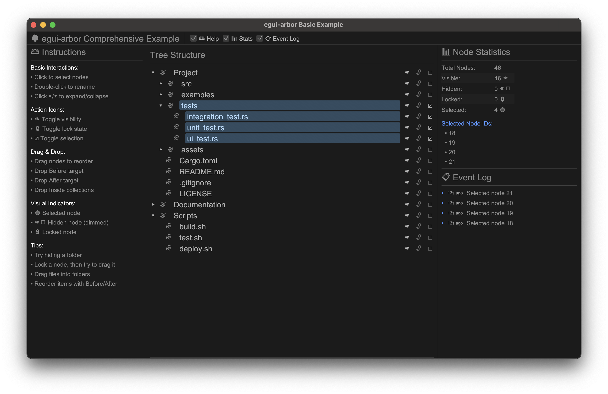

# egui-arbor



A flexible tree/outliner widget for [egui](https://github.com/emilk/egui) - hierarchical data visualization and editing inspired by Blender's outliner.

[](https://crates.io/crates/egui-arbor)
[](https://docs.rs/egui-arbor)
[](LICENSE-MIT)

## Features

- **Hierarchical Tree View**: Display nested data structures with collections and entities
- **Expand/Collapse**: Navigate through tree hierarchy with visual expand/collapse arrows
- **Drag & Drop**: Reorder and reparent nodes with Before/After/Inside positioning
- **Action Icons**: Built-in visibility, lock, and selection toggles with custom icon support
- **Inline Editing**: Double-click to rename nodes with keyboard shortcuts
- **Node Selection**: Single or multi-selection with visual highlighting
- **Customizable Styling**: Configure indentation, colors, icons, and spacing
- **Trait-Based Integration**: Works with any data structure implementing [`OutlinerNode`](src/traits.rs:96)
- **egui Memory Integration**: Automatic state persistence across frames

## Quick Start

Add to your `Cargo.toml`:

```toml
[dependencies]
egui-arbor = "0.1"
```

### Basic Example

```rust
use egui_arbor::{Outliner, OutlinerNode, OutlinerActions, ActionIcon};

// 1. Define your data structure
#[derive(Clone)]
struct TreeNode {
    id: u64,
    name: String,
    children: Vec<TreeNode>,
}

// 2. Implement OutlinerNode trait
impl OutlinerNode for TreeNode {
    type Id = u64;
    
    fn id(&self) -> Self::Id { self.id }
    fn name(&self) -> &str { &self.name }
    fn is_collection(&self) -> bool { !self.children.is_empty() }
    fn children(&self) -> &[Self] { &self.children }
    fn children_mut(&mut self) -> &mut Vec<Self> { &mut self.children }
    
    fn action_icons(&self) -> Vec<ActionIcon> {
        vec![ActionIcon::Visibility, ActionIcon::Lock, ActionIcon::Selection]
    }
}

// 3. Implement OutlinerActions trait
struct MyActions {
    selected: Option<u64>,
}

impl OutlinerActions<TreeNode> for MyActions {
    fn on_select(&mut self, id: &u64, selected: bool) {
        self.selected = if selected { Some(*id) } else { None };
    }
    
    fn is_selected(&self, id: &u64) -> bool {
        self.selected == Some(*id)
    }
    
    // Implement other required methods...
    fn on_rename(&mut self, id: &u64, new_name: String) { /* ... */ }
    fn on_move(&mut self, id: &u64, target: &u64, position: DropPosition) { /* ... */ }
    fn is_visible(&self, id: &u64) -> bool { true }
    fn is_locked(&self, id: &u64) -> bool { false }
    fn on_visibility_toggle(&mut self, id: &u64) { /* ... */ }
    fn on_lock_toggle(&mut self, id: &u64) { /* ... */ }
    fn on_selection_toggle(&mut self, id: &u64) { /* ... */ }
    fn on_custom_action(&mut self, id: &u64, icon: &str) { /* ... */ }
}

// 4. Use in your egui code
fn show_tree(ui: &mut egui::Ui, nodes: &[TreeNode], actions: &mut MyActions) {
    let response = Outliner::new("my_tree")
        .show(ui, nodes, actions);
    
    // Handle events
    if let Some(id) = response.selected() {
        println!("Selected node: {:?}", id);
    }
    
    if let Some((id, new_name)) = response.renamed() {
        println!("Renamed node {} to {}", id, new_name);
    }
    
    if let Some(drop_event) = response.drop_event() {
        println!("Moved node {} to {}", drop_event.source, drop_event.target);
    }
}
```

## Comprehensive Example

Run the included example to see all features in action:

```bash
cargo run --example basic
```

The example demonstrates:
- Tree structure with collections and entities
- All action icons (visibility, lock, selection)
- Drag & drop with visual feedback
- Inline renaming with double-click
- Event logging and statistics
- Custom styling options

## Core Concepts

### OutlinerNode Trait

Implement this trait on your data structure to make it work with the outliner:

```rust
pub trait OutlinerNode {
    type Id: Hash + Eq + Clone;
    
    fn id(&self) -> Self::Id;
    fn name(&self) -> &str;
    fn is_collection(&self) -> bool;
    fn children(&self) -> &[Self];
    fn children_mut(&mut self) -> &mut Vec<Self>;
    fn icon(&self) -> Option<IconType> { None }
    fn action_icons(&self) -> Vec<ActionIcon> { vec![] }
}
```

### OutlinerActions Trait

Handle user interactions by implementing this trait:

```rust
pub trait OutlinerActions<N: OutlinerNode> {
    fn on_rename(&mut self, id: &N::Id, new_name: String);
    fn on_move(&mut self, id: &N::Id, target: &N::Id, position: DropPosition);
    fn on_select(&mut self, id: &N::Id, selected: bool);
    fn is_selected(&self, id: &N::Id) -> bool;
    fn is_visible(&self, id: &N::Id) -> bool;
    fn is_locked(&self, id: &N::Id) -> bool;
    fn on_visibility_toggle(&mut self, id: &N::Id);
    fn on_lock_toggle(&mut self, id: &N::Id);
    fn on_selection_toggle(&mut self, id: &N::Id);
    fn on_custom_action(&mut self, id: &N::Id, icon: &str);
}
```

### Action Icons

Built-in action icons:
- **Visibility** (👁/🚫): Toggle node visibility
- **Lock** (🔒/🔓): Prevent modifications
- **Selection** (☑/☐): Quick selection toggle
- **Custom**: Define your own with custom icons and tooltips

### Drag & Drop

Three drop positions supported:
- **Before**: Insert before the target node
- **After**: Insert after the target node  
- **Inside**: Add as child of target (collections only)

Automatic validation prevents invalid operations (e.g., parent into child).

## Customization

### Custom Styling

```rust
use egui_arbor::{Outliner, Style, ExpandIconStyle};

let style = Style::default()
    .with_indent(20.0)
    .with_row_height(24.0)
    .with_selection_color(egui::Color32::from_rgb(100, 150, 255));

Outliner::new("styled_tree")
    .with_style(style)
    .show(ui, &nodes, &mut actions);
```

### Custom Icons

```rust
impl OutlinerNode for MyNode {
    fn icon(&self) -> Option<IconType> {
        if self.is_folder {
            Some(IconType::Collection)
        } else {
            Some(IconType::Entity)
        }
    }
    
    fn action_icons(&self) -> Vec<ActionIcon> {
        vec![
            ActionIcon::Visibility,
            ActionIcon::Custom {
                icon: "⭐".to_string(),
                tooltip: Some("Favorite".to_string()),
            },
        ]
    }
}
```

## Architecture

egui-arbor follows egui ecosystem conventions:
- **User-owned data**: You own your data structures
- **Trait-based integration**: Flexible integration with any data type
- **Immediate mode**: Widget reconstructed each frame
- **egui memory integration**: Automatic state persistence

See [`ARCHITECTURE.md`](ARCHITECTURE.md) for detailed design documentation.

## Features

### Optional Features

- `serde`: Enable serialization support for state persistence

```toml
[dependencies]
egui-arbor = { version = "0.1", features = ["serde"] }
```

## Minimum Supported Rust Version (MSRV)

Rust 1.76 or later (edition 2024).

## License

Licensed under either of:

- Apache License, Version 2.0 ([LICENSE-APACHE](LICENSE-APACHE) or http://www.apache.org/licenses/LICENSE-2.0)
- MIT license ([LICENSE-MIT](LICENSE-MIT) or http://opensource.org/licenses/MIT)

at your option.

## Contributing

Contributions are welcome! Please feel free to submit a Pull Request.

## Acknowledgments

Inspired by [Blender's outliner](https://docs.blender.org/manual/en/latest/editors/outliner/index.html) and designed to integrate seamlessly with the egui ecosystem.